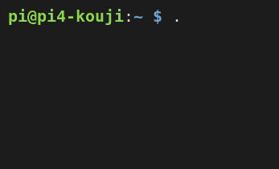

# max3010x
Go library to use the MAX3010x sensor for heart rate and SpO2 readings.

| :bangbang: | **This library has only been tested with a `MAX30102`. If you have a `MAX30100`, please help me with testing.** |
| :---: | :--- |


## TL;DR

You can download and build this test program:

```sh
$ go get github.com/cgxeiji/max3010x/max3010x
$ max3010x
```



## How to use?

It is as simple as:

```go
func main() {
    sensor, err := max3010x.New()
    if err != nil {
        log.Fatal(err)
    }
    defer sensor.Close()

    // Detect the heart rate
    hr, err := sensor.HeartRate()
    if errors.Is(err, max3010x.ErrNotDetected) {
        hr = 0
    } else if err != nil {
        log.Fatal(err)
    }
    fmt.Println("Heart rate:", hr)

    // Detect the SpO2 level
    spO2, err := sensor.SpO2()
    if errors.Is(err, max3010x.ErrNotDetected) {
        spO2 = 0
    } else if err != nil {
        log.Fatal(err)
    }
    fmt.Println("SpO2:", spO2)
}
```

Trying to read the heart rate or SpO2 values when the sensor is not in contact
with a person will return a `max3010x.ErrNotDetected` error. You are free to
handle this however you like.

### Low-level interface

If you need to access specific functions of each sensor, or want to work with
raw data, you can cast the `sensor` to the specific `device`:

```go
func main() {
    sensor, err := max3010x.New()
    if err != nil {
        log.Fatal(err)
    }

    defer sensor.Close()
    device, err := sensor.ToMax30102()
    if errors.Is(err, max3010x.ErrWrongDevice) {
        fmt.Println("device is not MAX30102")
        return
    } else if err != nil {
        log.Fatal(err)
    }

    // Get the values for the IR and red LEDs.
    ir, red, err := device.IRRed()
    if err != nil {
        log.Fatal(err)
    }
}
```

## Any questions or feedback?

[Issues](https://github.com/cgxeiji/max3010x/issues/new) and
[pull-requests](https://github.com/cgxeiji/max3010x/pulls) are welcomed!
